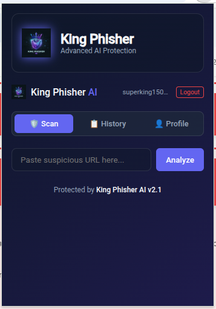
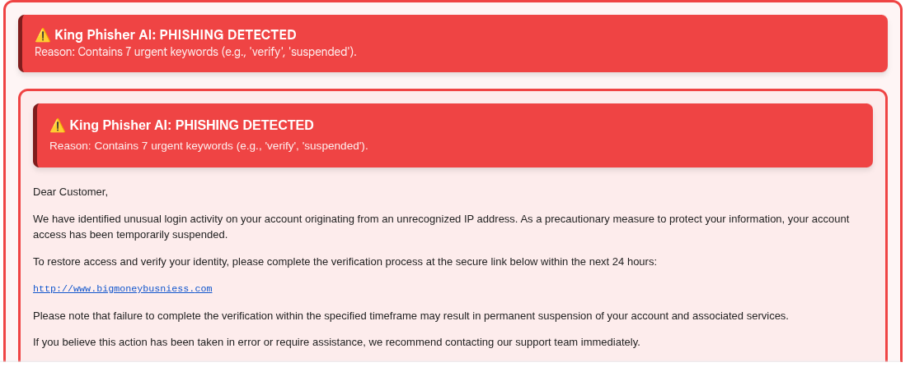

# King Phisher AI: Advanced Phishing Detection Ecosystem 👑🛡️

[](https://fastapi.tiangolo.com/)
[](https://scikit-learn.org/)
[](https://developer.chrome.com/docs/extensions/mv3/intro/)
[](https://www.sqlite.org/)

**King Phisher AI** is a production-grade, full-stack cybersecurity platform engineered to mitigate the risks of modern phishing attacks. By synthesizing **Random Forest Machine Learning** with a proprietary **Heuristic Safety Net**, the system provides real-time, non-invasive protection across both web browsing and email communications.

---

## 📖 Table of Contents
- [📸 Visual Showcase](#-visual-showcase)
- [🌟 Key Features](#-key-features)
- [🏗️ System Architecture](#️-system-architecture)
- [🧠 Detection Methodology](#-detection-methodology)
- [🚀 Installation & Setup](#-installation--setup)
- [📈 Technical Specifications](#-technical-specifications)
- [🛡️ Security Disclosure](#️-security-disclosure)

---

## 📸 Visual Showcase

> [!TIP]
> To maximize your portfolio impact, upload your screenshots to the `/screenshots` directory and name them exactly as shown below.

### 1. Protection Dashboard

*Modern, glassmorphic UI providing centralized security controls.*

### 2. Gmail Smart-Scanner

*Automatic threat detection and UI injection within Gmail interfaces.*

---

## 🌟 Key Features

*   **Hybrid AI Engine**: Dual-layer detection using a Random Forest Classifier and a heuristic-based rule engine.
*   **Gmail Smart-Scanner**: Passive DOM monitoring utilizing `MutationObserver` API for zero-latency email analysis.
*   **Explainable AI (XAI)**: Provides human-readable justifications for every threat detected to increase user security awareness.
*   **Cloud-Sync History**: Persistent threat logging via a secure FastAPI backend and SQLAlchemy ORM.
*   **Zero-Trust Architecture**: Encrypted password storage using Bcrypt and stateless session management via JWT.

---

## 🏗️ System Architecture

King Phisher AI is built on a modular, service-oriented architecture:

1.  **Inference Service**: A Python-based backend that manages ML model lifecycles and handles high-frequency scan requests.
2.  **Client Layer**: A Manifest V3 Chrome Extension that acts as the primary sensor, capturing URL and email patterns.
3.  **Persistence Layer**: A relational SQLite database managed via SQLAlchemy for high-integrity data storage.

---

## 🧠 Detection Methodology

> [!IMPORTANT]
> The system does not rely on a single data point. It analyzes over **12+ unique features** per scan.

### URL Analysis
- **Lexical Analysis**: Detecting suspicious characters (e.g., `@`, `-`) and TLD anomalies.
- **Structural Checks**: Monitoring URL length and subdomain depth.

### Email Analysis
- **NLP Processing**: Identifying urgent language, financial pressure, and suspicious call-to-actions.
- **Link Verification**: Verifying the integrity of links embedded within email bodies.

---

## 🚀 Installation & Setup

### Backend (Production Mode)
```bash
# Clone the repository
git clone https://github.com/yourusername/KingPhisher.git
cd KingPhisher/backend

# Initialize Virtual Environment
python -m venv venv
source venv/bin/activate  # On Windows use `venv\Scripts\activate`

# Install Dependencies
pip install -r requirements.txt

# Start the API Server
uvicorn main:app --reload --port 8000
```

### Chrome Extension (Developer Mode)
1.  Navigate to `chrome://extensions/`.
2.  Enable **Developer Mode** (top-right toggle).
3.  Click **Load Unpacked**.
4.  Select the `extension` directory from this project.

---

## 📈 Technical Specifications
- **ML Algorithm**: Random Forest (Ensemble Learning).
- **Dataset Size**: 600,000+ labeled phishing/legitimate samples.
- **Backend Latency**: ~150ms average response time.
- **Extension Standard**: Chrome Manifest V3.

---

## 🛡️ Security Disclosure
This project is developed for **educational and defensive purposes only**. The ML models are trained on historical phishing data to provide a demonstration of AI-driven security.
